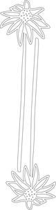
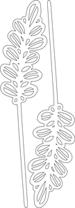
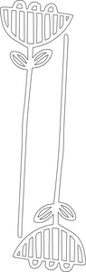
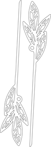
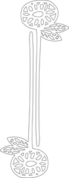
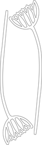

# seed pods

## formats

### tileable_rudebekia
* link: [/tileable_rudebekia](tileable_rudebekia)  
  
* width: 162 mm  
* height: 594 mm  
* thickness:   
* material:   
 

### tileable_small_fern
* link: [/tileable_small_fern](tileable_small_fern)  
  
* width: 90 mm  
* height: 360 mm  
* thickness:   
* material:   
 

### tileable_large_fern
* link: [/tileable_large_fern](tileable_large_fern)  
  
* width: 165 mm  
* height: 435 mm  
* thickness:   
* material:   
 

### tileable_flower_1
* link: [/tileable_flower_1](tileable_flower_1)  
  
* width: 130 mm  
* height: 405 mm  
* thickness:   
* material:   
 

### tileable_flower_2
* link: [/tileable_flower_2](tileable_flower_2)  
  
* width: 175 mm  
* height: 470 mm  
* thickness:   
* material:   
 

### tileable_flower_3
* link: [/tileable_flower_3](tileable_flower_3)  
  
* width: 175 mm  
* height: 445 mm  
* thickness:   
* material:   
 

### tileable_flower_4
* link: [/tileable_flower_4](tileable_flower_4)  
  
* width: 125 mm  
* height: 420 mm  
* thickness:   
* material:   
 
